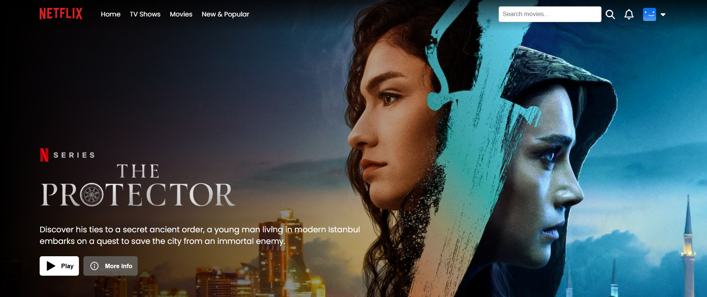

# 🎬 Netflix Clone


A full-featured Netflix clone built with React.js and Firebase, fetching real movie data from TMDB API.
It includes authentication, search functionality, movie/TV show browsing, player page for trailers, responsive design, and more.

🔗 **Live Website:** [https://watch-fly.vercel.app/](https://watch-fly.vercel.app/)

## 🖥️ Preview



---

## 🎯 Key Features

✅ User Authentication – Sign up, Login, Logout using Firebase.
✅ Firebase Firestore Integration – Store and manage user data.
✅ Responsive Navbar – Includes hamburger menu for tablets and mobile.
✅ Search Functionality – Search movies using TMDB API with live dropdown results.
✅ Movies & TV Shows Pages – Browse top-rated, trending, and new content.
✅ Player Page – Watch movie trailers (YouTube embed).
✅ Dynamic Routing – Each movie card links to its player page using react-router-dom.
✅ Protected Routes – Redirects unauthenticated users to login.
✅ Footer with Useful Links – Responsive design.
✅ Dark Overlay Backgrounds – Netflix-like visuals for hero sections.
✅ Security Features – XSS protection and secure credential management.

---

## 🛠️ Tech Stack
- **Frontend:** React.js 19.1, CSS (Responsive)
- **Backend:** Firebase Authentication, Firebase Firestore
- **API:** TMDB API
- **Routing:** React Router v7
- **Notifications:** React Toastify
- **Build Tool:** Vite
- **Deployment:** Vercel
- **Security:** XSS protection, Environment variables


## 🚀 Getting Started

### Prerequisites

Before you begin, ensure you have met the following requirements:
- **Node.js** (v14 or higher) - [Download & Install Node.js](https://nodejs.org/)
- **npm** or **yarn** - Package managers
- **Git** - Version control system
- **Firebase Account** - For authentication and hosting

### Installation

```bash
# Clone the repository
git clone https://github.com/your-username/netflix-clone.git

# Navigate to project folder
cd netflix-clone

# Install dependencies
npm install

# Create environment file
cp .env.example .env

# Add your API keys to .env file
# VITE_FIREBASE_API_KEY=your_firebase_api_key
# VITE_TMDB_API_TOKEN=your_tmdb_api_token

# Run the project
npm run dev
```

### Environment Variables

Create a `.env` file in the root directory and add:

```env
VITE_FIREBASE_API_KEY=your_firebase_api_key
VITE_FIREBASE_AUTH_DOMAIN=your_firebase_auth_domain
VITE_FIREBASE_PROJECT_ID=your_firebase_project_id
VITE_FIREBASE_STORAGE_BUCKET=your_firebase_storage_bucket
VITE_FIREBASE_MESSAGING_SENDER_ID=your_messaging_sender_id
VITE_FIREBASE_APP_ID=your_firebase_app_id
VITE_TMDB_API_TOKEN=your_tmdb_api_token
```

## 🗂️ Project Structure

```
src/
├── assets/               # Static assets (images, icons)
│   ├── cards/           # Movie/TV show cards
│   └── icons/           # Application icons
├── components/          # Reusable components
│   ├── Navbar/          # Navigation bar
│   ├── Footer/          # Footer component
│   ├── TitleCards/      # Content cards
│   └── SearchBar/       # Search functionality
├── pages/               # Application pages
│   ├── Home/            # Home page
│   ├── Login/           # Login page
│   ├── Player/          # Video player
│   ├── Movies/          # Movies page
│   ├── TV_Shows/        # TV Shows page
│   └── New_Popular/     # New & Popular content
├── App.jsx              # Main application component
├── main.jsx             # Application entry point
└── firebase.js          # Firebase configuration
```

## Show your support

Give a ⭐️ if this project helped you!

---

## 📜 License

This project is licensed under the [MIT License](LICENSE).

